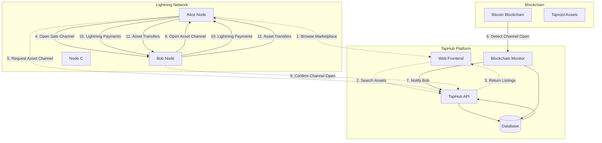
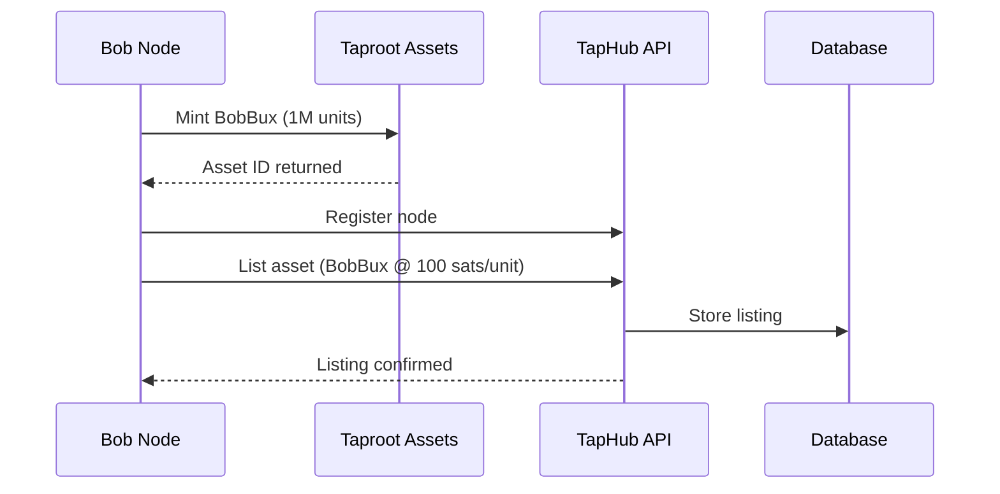
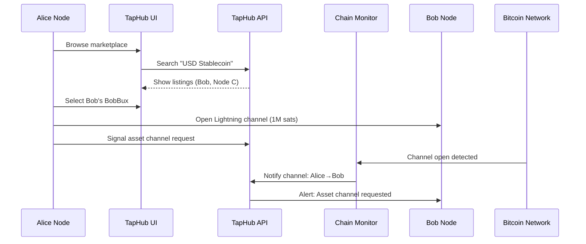
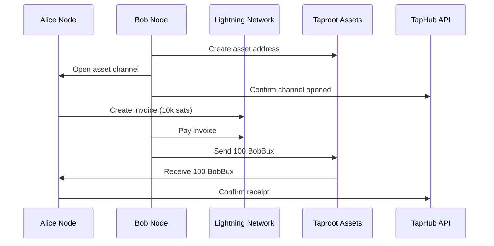

# TapHub Architecture

## Overview

TapHub is a marketplace for Lightning Network Taproot Assets trading, enabling users to discover asset-enabled edge nodes and facilitate asset channel creation between peers.

## Architecture Diagram

## Detailed Flow

### 1. Edge Node Registration (Bob's Setup)

### 2. User Discovery & Channel Opening (Alice's Journey)

### 3. Asset Channel Creation & Trading

## Component Details

### TapHub Web Frontend
- **Purpose**: User interface for asset discovery and trading
- **Features**:
  - Asset marketplace browsing
  - Price comparison
  - Channel request initiation
  - Transaction history

### TapHub API
- **Purpose**: Backend services for node registry and coordination
- **Features**:
  - Node registration
  - Asset listing management
  - Channel request handling
  - User authentication

### Blockchain Monitor
- **Purpose**: Detect on-chain channel opens between registered nodes
- **Features**:
  - Mempool scanning
  - Channel open detection
  - Automated notifications
  - State tracking

### Database
- **Purpose**: Persistent storage for platform data
- **Stores**:
  - Registered nodes (pubkeys)
  - Asset listings
  - Channel requests
  - Transaction history

## Key Interactions

### 1. Asset Discovery
Users browse available assets across multiple edge nodes, comparing:
- Asset types
- Pricing (sats per unit)
- Availability
- Channel requirements

### 2. Channel Coordination
TapHub facilitates the two-channel flow:
1. **Sats Channel**: Alice → Bob (detectable on-chain)
2. **Asset Channel**: Bob → Alice (off-chain, requires manual confirmation)

### 3. Trading Execution
- Lightning payments for asset purchases
- Taproot asset transfers
- Bidirectional trading support

## Security Considerations

1. **Trust Model**: Users must trust edge nodes for asset delivery
2. **Channel Detection**: Only registered nodes can be monitored
3. **Asset Verification**: Users confirm asset channel receipt
4. **Payment Atomicity**: Lightning payments are atomic, but asset delivery requires trust

## Technical Stack

- **Frontend**: Web interface for marketplace
- **Backend**: API for node coordination
- **Lightning**: LND for payment channels
- **Assets**: Taproot Assets Protocol (TAP)
- **Monitoring**: Bitcoin blockchain scanning
- **Database**: Node and asset registry